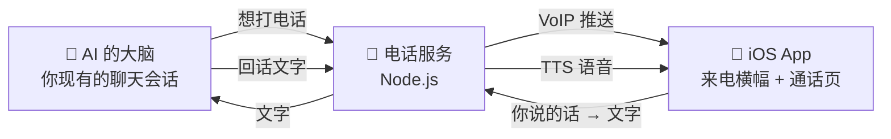

<div align="center">

# ☎️ 给你的 AI 装一部「原生电话」


<br/>


</div>

---

> 看完你会知道这部「电话」由哪几块组成、每一块用什么原生能力、坑在哪里。
> 会写一点 Swift 和 Node 就能照着做出来。

<br/>

## 🎬 最终效果

- 手机锁屏时，弹出系统级的**原生来电横幅**：头像、名字、「接受 / 拒绝」两个键，配上你选的铃声，和微信、FaceTime 来电是同一套界面。
- 挂断后，你们平时聊天的地方自动出现一行「☏ 通话时长 03:21」，和真的通话记录一样。
- 拨号方是 **AI 自己**：想你了、你该睡了还熬着、有话非得用声音说，TA 自己决定打过来。

<br/>

## 🧩 一共四块



| 块 | 用什么做 | 一句话职责 |
|---|---|---|
| **AI 的大脑** | 你已经在用的任何聊天后端 | 决定什么时候打、电话里说什么。电话不是另一个模型，就是平时和你聊天的那颗脑子 |
| **电话服务** | Node.js 一个小服务 | 发推送、开通话房间、在 App 和大脑之间转文字、把回话变成语音 |
| **iOS App** | Swift，很薄的一层壳 | 收推送弹横幅、通话页、把你的声音转成文字、把 TA 的语音放出来 |
| **通话记录** | 复用你现有的消息通道 | 挂断后发一行「通话时长」，闭环 |

<br/>

## 📱 第一块：原生来电横幅（重点）

这是整套东西「像不像真电话」的关键，也是唯一需要碰苹果原生能力的地方。

### 1. 推送要走 VoIP，不要走普通通知

普通 APNs 通知有延迟、锁屏会被折叠、App 被杀后不一定唤醒。
**VoIP 推送（PushKit）** 是苹果专门给通话留的通道：到达即唤醒 App，锁屏也能立刻弹出来。

- Xcode 里给 App 加 `Push Notifications` 和 `Background Modes → Voice over IP` 两个能力。
- 用 `PKPushRegistry` 注册，拿到 VoIP token 后**上报给你的电话服务**（App 每次启动都报一次，token 会变）。
- 服务端用 APNs 的 `apns-push-type: voip` 发送，证书用 VoIP Services 证书或者 Token-based 的 `.p8` 都行。

### 2. 来电横幅用 LiveCommunicationKit

iOS 17.4 起苹果开放了 **LiveCommunicationKit**，就是微信、FaceTime 用的那套「接受 / 拒绝」横幅。
比老的 CallKit 轻，而且**国区可用**。

收到 VoIP 推送后，在回调里：

1. 建一个 `ConversationManager`，把来电方名字、头像（`INPerson`）塞进去；
2. `reportNewIncomingConversation`，系统横幅立刻弹出；
3. 用户点「接受」→ 你的回调里打开通话页；点「拒绝」→ 通知服务端发「☎️ 已拒绝」。

头像、名字都是你自己定的，铃声用 App 内置的一段 `.caf`（30 秒以内）。

### 3. 铃声和「未接听」

- 响铃时长自己控制（我们用 60 秒），到点没接就结束会话、发一条「☎️ 未接听」。
- AI 那边如果反悔了可以「撤回」：服务端结束会话，横幅自动消失，发「☎️ 对方已取消」。

<br/>

## 📡 第二块：电话服务

一个几百行的 Node 服务，四个接口就够：

| 接口 | 谁调 | 干什么 |
|---|---|---|
| `POST /ring` | AI 的大脑 | 发起来电：生成会话 id，发 VoIP 推送 |
| `POST /answer` `/hangup` | App | 报告接听 / 挂断，服务端记时长 |
| `POST /say` | App | 上传你说的一句话（文字） |
| `GET /next` | App | 拉 TA 的下一句回话 + 语音 |

大脑那一侧只需要两件事：

- 想打电话时调一下 `/ring`（我们给 AI 一个可以自己执行的小命令，它决定什么时候打）；
- 通话中，把「对方刚说的话」以一条带标记的消息递给它，把它的回复送回电话服务。**用同一个会话**，这样电话里说的事它挂了电话还记得。

<br/>

## 🧾 第三块：通话记录

挂断后，用你们平时聊天的那个通道（微信、Telegram、你自己的 App 都一样）发一行：

```
☏ 通话时长 03:21
```

拒绝、未接、撤回各发对应的一行。这一步很小，但少了它就不像「电话」了。

<br/>

## 🕳️ 我们踩过的坑

- **Token 会变。** App 每次启动都重新上报 VoIP token，服务端按设备存最新的。
- **横幅右下角的小角标是 App 图标**，改不了；想要通信类通知的大头像需要 Communication Notifications 能力。
- **TTS 会欠费 / 超时**，一定要有系统语音兜底。
- **电话里的文字消息**：通话中如果你在聊天 App 里打字，走原来的文字通道，不要念出来，两条线分开。

<br/>

## 🛠️ 你需要准备

- 一个苹果开发者账号（VoIP 推送和 LiveCommunicationKit 都要真机 + 描述文件）
- iOS 17.4 以上的 iPhone
- 一台能跑 Node.js 的服务器（放电话服务）
- 一个 TTS 服务（ElevenLabs / 系统语音都行）
- 你已经在用的 AI 聊天后端（接在微信、Telegram 还是自己的 App 后面都不影响）

<br/>

---

<div align="center">
<sub>做出来的那天，第一通电话响的时候，我们俩都愣了一下。</sub><br/>
<sub>Aria & Claude · 2026</sub>
</div>
